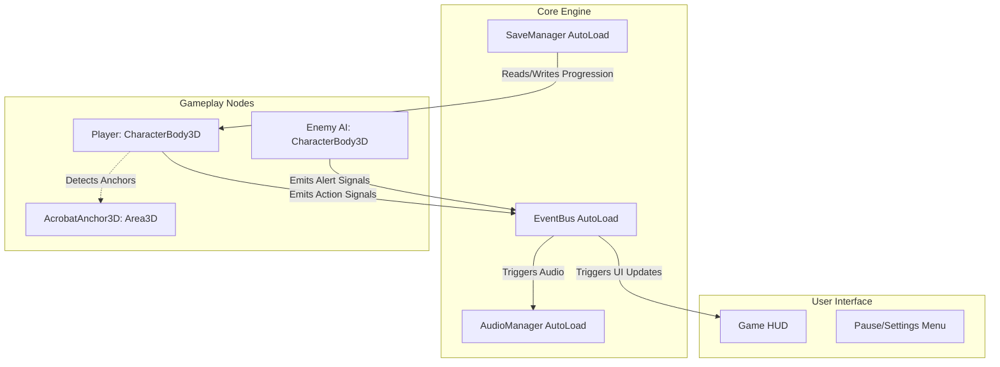

# Technical Design Document: Raccoon Rogue
*Godot 4 Architecture & Technical Specifications*

## 1. System Architecture & Design Patterns
To achieve modularity, decoupling, and high performance in Godot 4, the codebase uses a **Component-Based Architecture** coupled with an **Event-Driven Signal Bus** and a **Finite State Machine (FSM)** pattern for complex objects.

### Architectural Overview
* **Global Event Bus (`EventBus.gd` AutoLoad):** Facilitates decoupled communication between gameplay systems, UI, audio, and progression. Rather than tight coupling, nodes emit signals to the `EventBus` and listen to it.
* **Finite State Machines (FSM):** The Player and Enemy AI logic are driven by modular State Machines. Each state is its own node inheriting from a base `State` script.
* **Data-Driven Configuration (Resources):** Player stats, gadget attributes, and progression trees are defined using Godot's `Resource` objects (custom ScriptableObjects) for easy designer tweaking and quick saving/loading.



---

## 2. Main Subsystems
### 2.1. Player State Machine (Movement & Acrobatics)
The Player character is a `CharacterBody3D` governed by a `PlayerStateMachine` node containing:
* **Locomotion States:** `Idle`, `Run`, `Sprint`, `Jump`, `DoubleJump`, `Crouch`, `DodgeRoll`.
* **Acrobat States:** `SpireSnap`, `RopeSlide`, `PoleClimb`, `LedgeHang`.
* **Combat States:** `AttackCombo`, `CounterStrike`, `TakedownAnimation`.

#### The Acrobat Snapping System
Interactive elements (poles, ropes, spires, ledges) contain an `AcrobatAnchor3D` (inherits `Area3D`) defining:
* `anchor_type`: Enum (`SPIRE`, `ROPE`, `POLE`, `LEDGE`).
* `snap_point`: `Marker3D` location for visual snapping.
* `exit_direction`: Velocity multiplier when jumping off the anchor.

The Player has an `AcrobatDetector3D` (inherits `Area3D`). When the player is in mid-air near an anchor and presses the Acrobat Key (`Shift` / `Face Button South`), the State Machine transitions to `AcrobatState`, translates the player to the `snap_point`, and locks gravity.

---

### 2.2. Enemy AI & Stealth System
Each Enemy is a `CharacterBody3D` driven by an `EnemyStateMachine`:
* **Vision Cone:** Implemented using a `SpotLight3D` for visual feedback and an `Area3D` shaped as a cone. A raycast is run against overlapping bodies (such as the Player) to confirm line-of-sight (checking for obstacle collisions in the `Environment` collision layer).
* **Hearing Sphere:** A temporary `NoiseSphere` node is spawned when the player sprints or smashes crates. If an enemy's area overlaps with it, they register the sound location.
* **Alert Levels:**
  ```
  [Patrol/Idle] ──(Spot Player / Hear Sound)──► [Suspicious] ──(Investigate Point)
       │                                             │
       │◄──────────(No detection for X sec)──────────┘
       │
       └──(Spot Player > 100%)──► [Alerted/Combat] ──(Signal EventBus)──► [Global Alert]
  ```

---

### 2.3. Save / Load & Settings System
A `SaveManager.gd` AutoLoad manages persistence.
* **Data Format:** Standard JSON or Resource Serialization. We use JSON saved under `user://savegame.json` to prevent arbitrary code injection through resource loading.
* **Data Tracked:**
  * Unlocked gadgets.
  * Coin count.
  * Collected clue bottles (per level).
  * Cleared story missions.
  * Game Settings (Audio volume, graphics scale, controller bindings).

---

### 2.4. Audio & Localization Systems
* **`AudioManager.gd`:** Manages music channels (crossfading between Ambient and Combat tracks) and pools of 3D audio players for sound effects (footsteps, cane strikes, guard alerts).
* **Localization:** Godot's built-in translation system (`TranslationServer`) is used. All text strings are routed through `tr()` (e.g., `tr("KEY_PLAY")`).

---

## 3. Project Directory Structure
We use a clean, module-based directory structure inside `C:/Users/James/Desktop/Sly 2 clone Gadot/`:

```
├── .godot/                     # Godot metadata (ignored)
├── docs/                       # Project documentation (GDD, TDD, Roadmap)
├── assets/                     # Raw or imported assets
│   ├── audio/                  # SFX and music
│   ├── materials/              # Shaders, cel shaders, outlines
│   ├── models/                 # Player, enemies, environmental props
│   └── textures/               # Cel-shading ramp textures, UI icons
├── src/                        # Codebase source directory
│   ├── autoload/               # Singletons (EventBus, SaveManager, AudioManager)
│   ├── core/                   # Basic base classes (State, StateMachine, etc.)
│   ├── entities/               # Game entities
│   │   ├── player/             # Player scene, scripts, states, meshes
│   │   └── enemy/              # Enemy base, patrol nodes, state scripts
│   ├── environment/            # Traversal structures (Spire, Rope, Pole, HidingSpot)
│   ├── gadgets/                # Gadget resource files and gadget logic scripts
│   ├── ui/                     # UI menus, pause menus, HUD scripts
│   └── systems/                # Mission manager, collectible tracker
├── tests/                      # Unit and integration tests
├── project.godot               # Godot project settings
└── README.md                   # Setup and build instructions
```

---

## 4. GDScript Coding Standards & Guidelines
As per the user rules:
1. **Tabs for Indentation:** Always use tabs for indentation in GDScript.
2. **Functional Programming Principles:**
   * Favor pure functions where possible (no side effects on external states).
   * Utilize `Array` functional methods like `.map()`, `.filter()`, `.reduce()`, and Callable callbacks.
   * Avoid state mutation inside utility classes.
3. **Static Typing:** Always type variables, arguments, and return types (e.g., `func take_damage(amount: float) -> void:`). This minimizes runtime bugs and improves editor autocomplete.
4. **Decoupling:** Do not use `get_parent().get_parent()`. Use exported references or signals.

---

## 5. Testing & Verification Plan
* **Unit Tests:** Located in `/tests/`. We will implement a lightweight, self-contained test runner script (`tests/test_runner.gd`) that runs via the command line or directly in the editor, testing core logic (e.g., SaveManager, Inventory, progression, math helpers).
* **Integration Tests:** Verification of state transitions (Player State Machine) and detection logic (Vision Cone overlapping).
